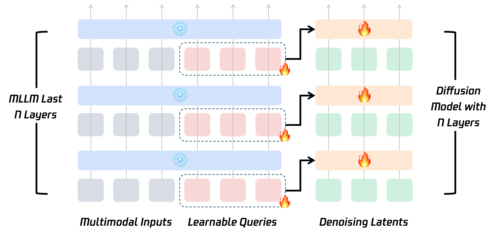
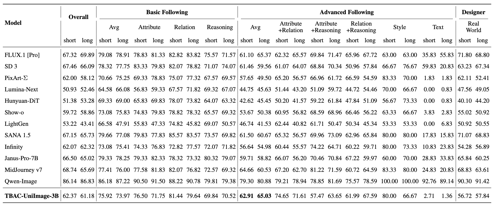

# TBAC-UniImage-3B

[Arxiv](https://arxiv.org/abs/2508.08098) | [Huggingface](https://huggingface.co/TencentBAC/TBAC-UniImage-3B)


## Overview
This repository contains the official model checkpoints of **TBAC-UniImage-3B**, an unified understanding and generation model developed by Basic Algorithm Center, Platform and Content Group, Tencent.

Our model is composed of two components: the [Qwen2.5-VL-3B-Instruct](https://huggingface.co/Qwen/Qwen2.5-VL-3B-Instruct) serves as the understanding module, while the [SANA-1600M](https://huggingface.co/Efficient-Large-Model/Sana_1600M_512px_diffusers) acts as the generation module. The conditions for generation are originate from representations of different Qwen2.5-VL-3B-Instruct layers.



## Update
2025.8.13 Released training code.

## Performance

### GenEval and DPG-Bench
| Method | Base (M)LLM | GenEval | DPG-Bench |
| :--- | :--- | :--- | :--- |
| MetaQuery | Qwen2.5-VL-3B-Instruct | 0.78 | 81.10 |
| | Qwen2.5-VL-7B-Instruct | 0.80 | 82.05 |
| BILP-3o | Qwen2.5-VL-3B-Instruct | 0.81 | 79.36 |
| | Qwen2.5-VL-7B-Instruct | 0.83 | 80.73 |
| BAGEL | MoT-7B | 0.82 | - |
| Show-o2 | Qwen2.5-1.5B-Instruct | 0.73 | 85.02 |
| | Qwen2.5-7B-Instruct | 0.76 | 86.14 |
| Tar | Qwen2.5-1.5B-Instruct | 0.76 | 82.96
| | Qwen2.5-7B-Instruct | 0.84 | 84.65 |
| Qwen-Image | Qwen2.5-VL-7B-Instruct | 0.87 | 88.32
| **Ours** | **Qwen2.5-VL-3B-Instruct** | **0.87** | 80.97 |

### TIIF-Bench



## Installation
```bash
pip install -r requirements.txt
```

## Quick Start
```bash
## Inference
python app.py --checkpoint_path TencentBAC/TBAC-UniImage-3B

## Train
sh train.sh
```

## Limitations
For a better experience, please use the text-to-image mode. The image-text-to-image capability is currently weaker (but you can still try it).

## Acknowledgements
The training and inference codes are modified from [MetaQuery](https://github.com/facebookresearch/metaquery). We thank them for their contribution!

## About
Created by the Tencent PCG Basic Algorithm Center. All rights reserved.